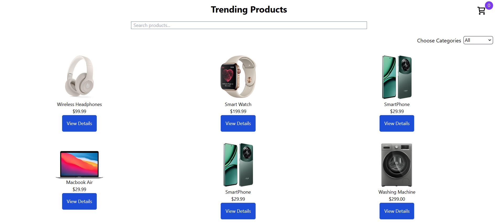
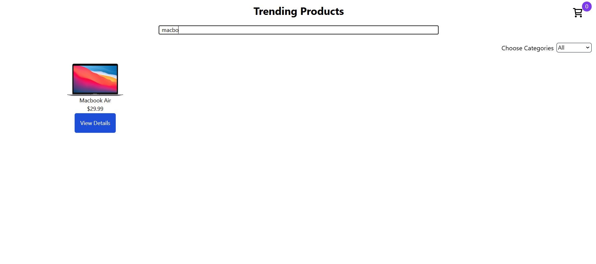
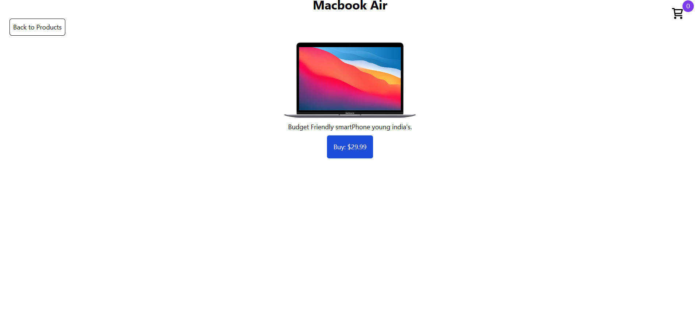
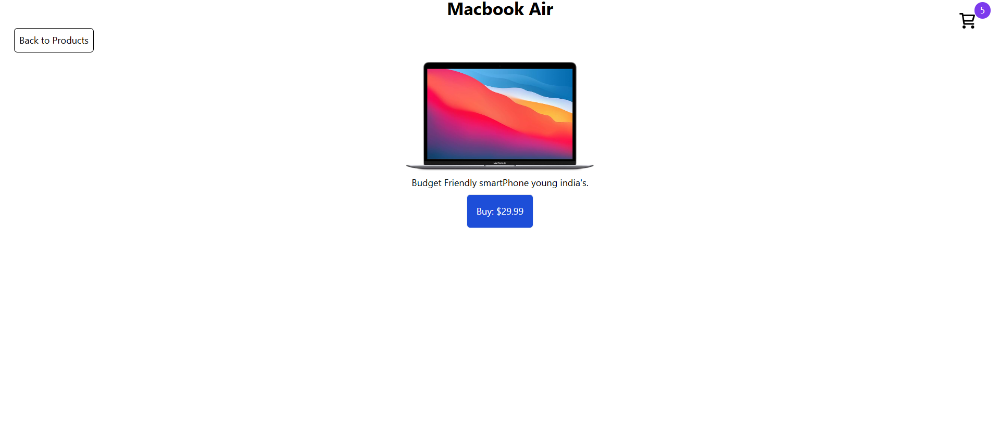
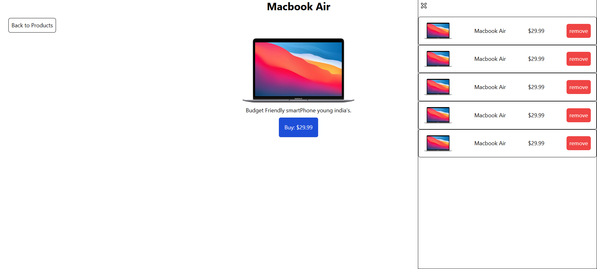

// how to install and run application

1. first download or clone this project from Github
2. run "npm i" in the terminal

// additional libraries i used?

1) Yes, i have only used tailwind css for styling purpose, nothing else.

// challenges that i faced and how i overcame them?

1) Yes, one challanged i faced in add to cart functionality, when i add the product in the cart, it dont have any issues then, but when i
remove product from the cart, all product removed at once because in my function i was adding and removing on the basis of product id, which is
wrong, so i research and found that i should i use a random value genrator(ex: date.now(),etc) for adding and deleting, thats how i overcame this
bug.

// optional enhancement

1. Implemented add to cart functionality with cart page thats shows all the product which currently in cart.
2. Added beautiful animation when user hover on the product
3. Used Tailwind css for styling and make it responsive across all devices

// Screenshot
1. HomePage

2. Searching functionality

3. Detail Page

4. Cart Functionality

5. Cart Window

